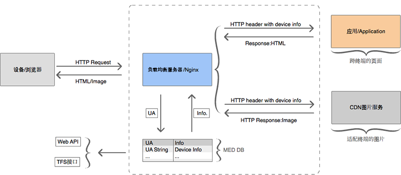
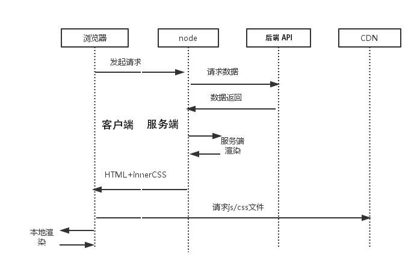
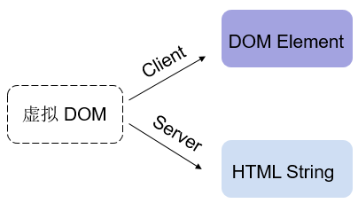
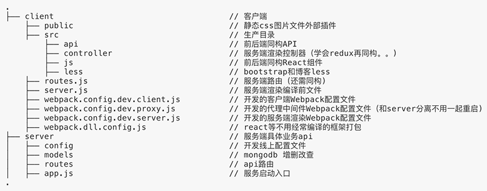

---

#全栈的简单实现

##大致流程

### nginx反向代理作用:
- 可以缓存真实Web服务器上的js,css静态资源，减轻真实Web服务器的负载压力；
- 保护网站安全：任何来自Internet的请求都必须先经过代理服务器；
- 充当负载均衡服务器均衡地分发请求，平衡集群中各个服务器的负载压力(宕机)

---

#服务端渲染(同构)

---

#服务端渲染(同构)

1. 前言

   为什么需要服务端渲染？什么情况下进行服务端渲染？笔者认为，当我们要求渲染时间尽量快、页面响应速度快时（优点），才会采用服务器渲染，并且应该“按需”对页面进行渲染 ——“首次加载/首屏”。即服务端渲染的优势在于：由中间层( node端 )为客户端请求初始数据、并由node渲染页面。那客户端渲染和服务端渲染有什么差别？服务端渲染究竟快在哪里呢？

2. 原因与思路

   客户端渲染路线：1. 请求一个html -> 2. 服务端返回一个html -> 3. 浏览器下载html里面的js/css文件 -> 4. 等待js文件下载完成 -> 5. 等待js加载并初始化完成 -> 6. js代码终于可以运行，由js代码向后端请求数据( ajax/fetch ) -> 7. 等待后端数据返回 -> 8. react-dom( 客户端 )从无到完整地，把数据渲染为响应页面

   服务端渲染路线：2. 请求一个html -> 2. 服务端请求数据( 内网请求快 ) -> 3. 服务器初始渲染（服务端性能好，较快） -> 4. 服务端返回已经有正确内容的页面 -> 5. 客户端请求js/css文件 -> 6. 等待js文件下载完成 -> 7. 等待js加载并初始化完成 -> 8. react-dom( 客户端 )把剩下一部分渲染完成( 内容小，渲染快 )
　　　

---
#React 同构
###React 虚拟 Dom

1. 客户端上，虚拟 Dom 通过 ReactDOM 的 Render 方法渲染到页面中
2. 服务端上，React 提供的另外两个方法：ReactDOMServer.renderToString 和 ReactDOMServer.renderToStaticMarkup 可将其渲染为 HTML 字符串。

---
#React 同构的关键要素
1. DOM 的一致性
在前后端渲染相同的 Compponent，将输出一致的 Dom 结构。

2. 不同的生命周期
在服务端上 Component 生命周期只会到 componentWillMount，客户端则是完整的。

3. 客户端 render 时机
同构时，服务端结合数据将 Component 渲染成完整的 HTML 字符串并将数据状态返回给客户端，客户端会判断是否可以直接使用或需要重新挂载。
以上便是 React 在同构/服务端渲染的提供的基础条件。在实际项目应用中，还需要考虑其他边角问题，例如服务器端没有 window 对象，dom操作需要做不同处理等。

---
#React 同构的一些细节

1. 前后端请求业务api都是一致的，可以统一同构，本例使用axios;

2. 平台区分webpack可以加DefinePlugin插件设值判断，确有不同需要不同模块处理的逻辑也可以配置配置resolve.alias属性区分。

3. node不支持webpack和部分es6语法需要先用webpack编译好node识别的语法文件

4. 服务端less文件不编译，客户端以外链的形式编译引入，图片打包输出相同url。。webpack-isomorphic-tools这个工具可能更好，待研究

---
# 与后端的业务数据交互

### 以express为例 处理简单业务

1. app.js程序入口，主要加载一些中间件如url、cookie、json解析、session管理，redis缓存等，监听端口等待处理请求

2. routes目录保存所有api请求路由，如：

		app.get('/login', function (req, res) { //处理http://host/login请求
        	/*
        	* req 请求封装的属性
        	* res 响应的方法
        	*/
        	//处理具体业务
        	var userName=req.query.userName;//获取get请求userName参数值
        	res.send('Hello world!'); //返回字符串
        	res.json({
        		success:true
        	}); //返回json
        	res.render('login') //返回login模板
    	});
3. 连接mongodb
		
		var mongodb = require('mongodb');
        var mongodbServer = new mongodb.Server('localhost', 27017, { auto_reconnect: true, poolSize: 10 });//配置连接属性
        var db = new mongodb.Db('myblog', mongodbServer); //创建一个连接mongdb方法
        
---
# mongodb 查询数据
### 以官方简单回调的方式操作

	var query = function (name, callback) {  //以函数回调的方式操作处理
    //打开数据库
    db.open(function (err, db) { //打开创建的连接方法
        if (err) { //错误处理，下同
            return callback(err);
        }
        //读取 posts表集合
        db.collection('posts', function (err, collection) {
            if (err) {
                mongodb.close(); //每次操作完必须关闭连接
                return callback(err);
            }
            query.name = name;//查询条件，已传入name查询字段name数据
            collection.find(query,{
            		limit: 10 //限制查询10条数据
            	}).sort({
     	            time: -1 //以字段time倒序查询
                }),toArray(function (err, doc) {
                if (err) {
                    mongodb.close();
                    return callback(err);
                }
                callback(null, doc); //返回回调函数查询到的doc
                mongodb.close();
           	 });
        });
    });

---
# mongodb 添加数据

	var query = function (post, callback) {  //以函数回调的方式操作处理
	 //要存入数据库的文档
        var post = {
            name: post.name,
            password: post.password,
        };
    //打开数据库
    db.open(function (err, db) {
        if (err) {
            return callback(err);
        }
        //读取 posts 集合
        db.collection('posts', function (err, collection) {
            if (err) {
                mongodb.close();
                return callback(err);
            }
            //将文档插入 posts 集合
            collection.insert(post, {
                safe: true //mongdb是异步，确保返回错误也有结果
            }, function (err, doc) {
                mongodb.close();
                if (err) {
                    return callback(err);//失败！返回 err
                }
                callback(err, doc);//返回 err 为 null
            });
        });
    });

---
# 返回结果给前端
        app.post('/login', function (req, res) {
            //检查用户是否存在
            User.get(req.body.name, function (err, user) { //function (name, callback)
                //检查密码是否一致
                if (!user || user.password != req.body.password) { //判断查询到的此用户密码是否为输入的登录密码
                    return res.json({//密码错误
                        success: false,
                        msg: '用户名或密码错误'
                    });
                }
                //用户名密码都匹配后，将用户信息存入 session
                req.session.user = user;
                res.json({//成功！返回文章页
                    success: true,
                    token: req.sessionID, //给以后redux用户状态管理用
                    msg: '/'//登陆成功后跳转到主页
                });
            });
        });

---
# blog目录结构

